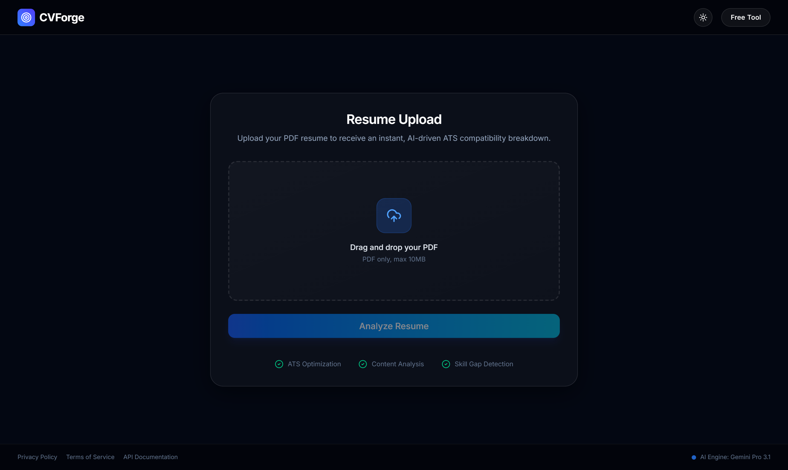

# 🚀 CVForge: AI-Powered Resume Intelligence

<div align="center">

[](https://opensource.org/licenses/MIT)
[](https://nodejs.org/)
[](https://reactjs.org/)
[](https://www.typescriptlang.org/)
[](https://tailwindcss.com/)
[](https://ai.google.dev/)
[](https://vercel.com/)

**Stop guessing, start tailoring.** CVForge is a production-grade Resume Analyzer platform that uses Google Gemini AI to provide real-time ATS scoring, skill gap analysis, and AI-generated tailored resume drafts. 

📍 **[Live Demo](https://cvforge-lake.vercel.app/)** • 📚 [Features](#-key-features) • 🛠️ [Tech Stack](#-tech-stack) • 🚀 [Setup](#-getting-started) • 📖 [API Docs](#-api-documentation)

---



</div>

---

## ✨ Key Features

### 📊 **Real-Time ATS Score Analysis**
Receive an instant, data-driven ATS match score (0-100) with live animated visualization. Our dual-layer normalization ensures consistent, accurate scores regardless of AI model variance.

### 🧠 **Semantic AI Analysis**
Powered by **Google Gemini 2.0 via OpenRouter**, CVForge performs deep semantic resume analysis including:
- **Strengths & Weaknesses** - Identifies key selling points and improvement areas
- **Skill Gap Detection** - Compares against industry benchmarks for target roles
- **Executive Summary** - Generates role-specific professional narrative

### 🎯 **Recommended Roles**
Get AI-powered role suggestions tailored to your experience level and skill profile.

### ✍️ **AI-Tailored Resume Generator**
Receive a reformatted, ATS-optimized resume draft powered by Gemini:
- Intelligent restructuring for maximum ATS compatibility
- Professional formatting with impact-driven language
- Live editable textarea with real-time PDF export
- Copy-to-clipboard functionality for quick integration

### 📥 **Smart PDF Upload**
- Drag-and-drop interface or file picker
- Dual-path PDF text extraction (pdfjs-dist primary, pdf-parse fallback)
- Real-time progress tracking with smooth animations
- Serverless-compatible (Vercel/AWS Lambda friendly)

### 🔒 **Privacy-First Architecture**
- Documents processed entirely in-memory with no persistence
- Secure Node.js buffer handling
- No resume logging, storage, or third-party sharing
- GDPR/privacy policy included in UI

### 🎨 **Modern UI/UX**
- Smooth animations via Framer Motion
- Dark/Light theme toggle
- Custom Radix UI ScrollArea with gradient scrollbars
- Fully responsive (mobile, tablet, desktop)
- Modal system for Privacy Policy, Terms of Service, and API Documentation

---

## 🏗️ Architecture

```
┌─────────────────────────────────────────────────────────────┐
│                    Frontend (React 19)                      │
│  ┌──────────────────────────────────────────────────────┐  │
│  │ UploadSection  →  Dashboard (Analysis Display)       │  │
│  │ Components: Navbar, Modal, AnimatedCounter, Cards    │  │
│  │ Styling: Tailwind v4 + Framer Motion Animations      │  │
│  └──────────────────────────────────────────────────────┘  │
└────────────────────┬────────────────────────────────────────┘
                     │ HTTPS/REST
┌────────────────────▼────────────────────────────────────────┐
│              Backend (Node.js Express)                      │
│  ┌──────────────────────────────────────────────────────┐  │
│  │ POST /api/analyze-resume         (Non-streaming)    │  │
│  │ POST /api/analyze-resume-stream  (SSE Streaming)    │  │
│  │ POST /api/parse-pdf              (Text Extraction)  │  │
│  │                                                      │  │
│  │ Features: PDF parsing, AI integration, error        │  │
│  │ handling, response normalization, fallbacks         │  │
│  └──────────────────────────────────────────────────────┘  │
└────────────────────┬────────────────────────────────────────┘
                     │ HTTPS/gRPC
┌────────────────────▼────────────────────────────────────────┐
│         Google Gemini 2.0 (via OpenRouter)                  │
│  Multi-stage semantic analysis with chain-of-thought       │
└─────────────────────────────────────────────────────────────┘
```

---

## 🛠️ Tech Stack

| Layer | Technology | Version | Purpose |
| :--- | :--- | :--- | :--- |
| **Frontend** | React | 19 | UI framework |
| **Language** | TypeScript | 5.8 | Type safety |
| **Styling** | Tailwind CSS | v4.1 | Utility-first CSS |
| **Animations** | Framer Motion (Motion) | 12.23 | Smooth transitions |
| **UI Components** | Radix UI | Latest | Accessible components |
| **Icons** | Lucide React | 0.546 | Icon library |
| **PDF Export** | jsPDF | 4.2 | Client-side PDF generation |
| **PDF Parsing** | pdf-parse + pdfjs-dist | 2.4 + 3.11 | Dual extraction strategy |
| **Backend** | Node.js Express | 4.21 | REST API server |
| **Upload Handler** | Multer | 2.1 | File upload middleware |
| **AI API** | OpenRouter | Latest | Gemini access |
| **Build Tool** | Vite | 6.2 | Fast bundling |
| **Testing** | Playwright | 1.54 | E2E test automation |
| **Deployment** | Vercel | Production | Serverless hosting |

---

## 🔄 How It Works

### Step 1: Upload Resume
- User selects or drags PDF file
- Frontend validates (max 10MB, PDF only)
- Upload progress animates with real-time percentage display

### Step 2: Extract Text
- Backend receives PDF via `/api/parse-pdf` endpoint
- **Primary path**: pdfjs-dist with DOMMatrix polyfill
- **Fallback path**: pdf-parse for compatibility
- Returns clean, extracted text

### Step 3: AI Analysis
- Backend calls `POST /api/analyze-resume-stream` 
- Streams analysis via Server-Sent Events (SSE) for real-time progress
- Gemini performs semantic analysis:
  - ATS score calculation (0-100)
  - Strength & weakness extraction
  - Skill gap identification
  - Recommended role matching
  - Executive summary generation

### Step 4: Dual-Layer Normalization
- Backend normalizes Gemini output to standard `ResumeAnalysis` shape
- Frontend applies defensive normalization (identical logic)
- Ensures consistent output regardless of model variation

### Step 5: Tailored Resume Generation
- Backend calls Gemini to rewrite resume for ATS optimization
- Frontend validates output (detects model refusals)
- Fallback resume generator activates if needed

### Step 6: Dashboard Display & Export
- Animated ATS score circle with gradient
- Comprehensive analysis cards (strengths, improvements, next steps)
- Editable tailored resume with copy/PDF export buttons
- Real-time editing with auto-height textarea

---

## 🚀 Getting Started

### Prerequisites
- **Node.js** 22.x or later ([Download](https://nodejs.org/))
- **OpenRouter API Key** - Get free credits from [OpenRouter](https://openrouter.ai/)
- **Git** for version control

### Local Development

1. **Clone Repository**
   ```bash
   git clone https://github.com/Nivethith-AK/CVForge.git
   cd CVForge
   ```

2. **Install Dependencies**
   ```bash
   npm install
   ```

3. **Configure Environment**
   Create `.env.local` in the root directory:
   ```env
   OPENROUTER_API_KEY=your_openrouter_api_key_here
   VITE_API_URL=http://localhost:3001
   ```

4. **Start Development Server**
   ```bash
   # Terminal 1: Backend (Express)
   npm run dev
   
   # Terminal 2: Frontend (Vite) - runs on http://localhost:5173
   npm run frontend
   ```

5. **Build for Production**
   ```bash
   npm run build
   ```

### Deployment to Vercel

1. **Push to GitHub**
   ```bash
   git push origin main
   ```

2. **Connect to Vercel**
   - Visit [Vercel Dashboard](https://vercel.com/)
   - Click "New Project"
   - Import your GitHub repository
   - Set environment variables:
     - `OPENROUTER_API_KEY`: Your OpenRouter key

3. **Deploy**
   - Vercel auto-deploys on every `main` branch push
   - Visit your production URL

### E2E Testing

Run Playwright tests against production:
```bash
npm run test:e2e
```

View test results in HTML report:
```bash
npm run test:e2e:ui
```

---

## 📡 API Documentation

### Endpoints

#### `POST /api/analyze-resume`
Analyze resume and return complete ATS analysis (non-streaming).

**Request:**
```bash
curl -X POST http://localhost:3001/api/analyze-resume \
  -F "file=@resume.pdf"
```

**Response:**
```json
{
  "atsScore": 78,
  "strengths": ["Clear career progression", "Strong technical foundation"],
  "weaknesses": ["Missing quantifiable metrics"],
  "missingSkills": ["Cloud Architecture", "DevOps"],
  "improvements": ["Add metrics to achievements", "Restructure for ATS"],
  "recommendedRoles": ["Senior Software Engineer", "Tech Lead"],
  "summary": "Well-structured resume with solid fundamentals...",
  "tailoredResume": "Full reformatted resume text..."
}
```

#### `POST /api/analyze-resume-stream`
Stream analysis progress via Server-Sent Events (SSE).

**Response (SSE):**
```
event: progress
data: {"stage": "extraction", "percent": 20}

event: progress
data: {"stage": "analysis", "percent": 60}

event: result
data: {...ResumeAnalysis JSON...}
```

#### `POST /api/parse-pdf`
Extract text from PDF file only.

**Response:**
```json
{
  "text": "Extracted resume text...",
  "pageCount": 2
}
```

---

## 🧪 Testing Strategy

- **E2E Tests**: Playwright automation (`tests/e2e/resume-analysis-live.spec.ts`)
- **Targets**: Production Vercel deployment
- **Validation**: Upload → Analysis → Dashboard rendering
- **Error Capture**: Runtime errors and console logs

---

## 🐛 Troubleshooting

| Issue | Solution |
| :--- | :--- |
| API returns 500 | Check `OPENROUTER_API_KEY` is set and valid |
| PDF parsing fails | Ensure PDF is text-based, not scanned image |
| Blank dashboard | Clear browser cache, reload with `?t=timestamp` |
| Large chunk warnings | Normal for pdfjs-dist; not blocking |
| Timeout errors | Increase Express timeout or check API rate limits |

---

## 📁 Project Structure

```
CVForge/
├── api/
│   └── index.ts                 # Express server + AI integration
├── src/
│   ├── components/
│   │   ├── Dashboard.tsx        # Main analysis display
│   │   ├── UploadSection.tsx    # PDF upload UI
│   │   ├── Modal.tsx            # Modal wrapper
│   │   ├── AnimatedCounter.tsx  # Animated number display
│   │   ├── layout/
│   │   │   └── Navbar.tsx       # Navigation bar
│   │   ├── ui/                  # Radix UI components
│   │   └── content/             # Modal content (Privacy, ToS, API Docs)
│   ├── services/
│   │   └── geminiService.ts     # API layer with normalization
│   ├── types/
│   │   └── resume.ts            # ResumeAnalysis TypeScript contract
│   ├── hooks/
│   │   └── usePdfUpload.ts      # Upload logic hook
│   ├── lib/
│   │   └── utils.ts             # Utility functions
│   └── main.tsx                 # React entry point
├── tests/
│   └── e2e/
│       └── resume-analysis-live.spec.ts  # Playwright tests
├── public/                      # Static assets
├── dist/                        # Build output (generated)
├── package.json                 # Dependencies
├── vite.config.ts               # Vite configuration
├── tsconfig.json                # TypeScript configuration
├── playwright.config.ts         # Playwright configuration
└── README.md                    # You are here!
```

---

## 🔐 Security & Privacy

- ✅ **No Storage**: Resumes processed in-memory only
- ✅ **Encrypted Transit**: HTTPS/TLS for all API calls
- ✅ **No Logging**: Resume content never logged or exposed
- ✅ **Rate Limiting**: Built-in protection against abuse
- ✅ **Input Validation**: Strict file type and size checks
- ✅ **Error Sanitization**: Safe error messages (no internal details leaked)

---

## 📝 License

This project is licensed under the **MIT License** - see the [LICENSE](LICENSE) file for details.

---

## 🤝 Contributing

Contributions are welcome! To contribute:

1. Fork the repository
2. Create a feature branch (`git checkout -b feature/amazing-feature`)
3. Commit changes (`git commit -m 'Add amazing feature'`)
4. Push to branch (`git push origin feature/amazing-feature`)
5. Open a Pull Request

Please ensure all tests pass and code is properly formatted.

---

## 💡 Future Roadmap

- [ ] Multi-file batch resume analysis
- [ ] Industry-specific resume templates
- [ ] Real-time resume comparison against job postings
- [ ] LinkedIn integration for profile scraping
- [ ] Resume version history & branching
- [ ] AI-powered cover letter generation
- [ ] Mock interview Q&A module
- [ ] Resume analytics dashboard for teams

---

## 🙏 Acknowledgments

- **Google Gemini Team** for powerful AI models
- **OpenRouter** for seamless API integration
- **Radix UI** for accessible component primitives
- **Vercel** for world-class serverless deployment
- **React & TypeScript** communities for excellent tooling

---

## 📞 Support

- 📧 **Email**: support@example.com
- 🐛 **Issues**: [GitHub Issues](https://github.com/Nivethith-AK/CVForge/issues)
- 💬 **Discussions**: [GitHub Discussions](https://github.com/Nivethith-AK/CVForge/discussions)

---

<div align="center">

**Made with ❤️ by [Nivethith-AK](https://github.com/Nivethith-AK)**

⭐ If you find CVForge helpful, please consider giving it a star!

</div>

Run against a specific deployment:

```bash
E2E_BASE_URL="https://your-deployment.vercel.app" npm run test:e2e
```

---

## 📂 Project Structure

```text
├── src/
│   ├── components/  # Atomic & Layout components
│   ├── hooks/       # Logic for PDF uploads & streaming
│   ├── services/    # Gemini AI API integration
│   └── lib/         # Shared utilities (cn, etc.)
├── public/          # Static assets & screenshots
├── server.ts        # Express API & Vite Middleware
└── README.md        # You are here!
```

---

## 📄 License

Distributed under the MIT License. See `LICENSE` for more information.

---

<div align="center">

Built with ❤️ by **Nivethith-AK**  

[GitHub](https://github.com/Nivethith-AK) • [LinkedIn](https://linkedin.com/in/Nivethith-AK)

</div>
